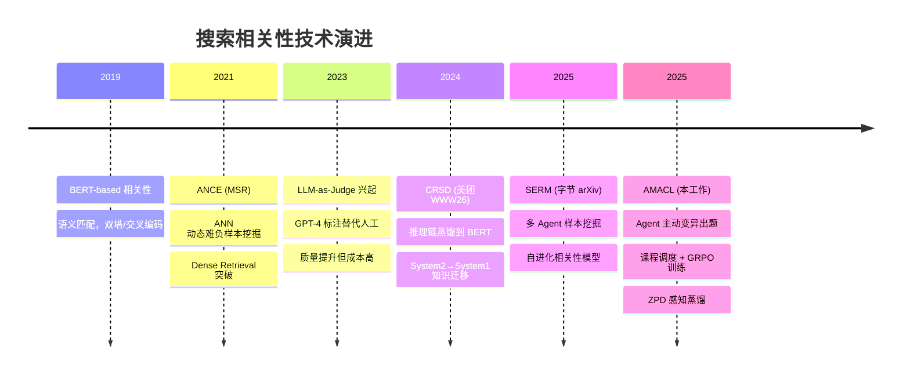
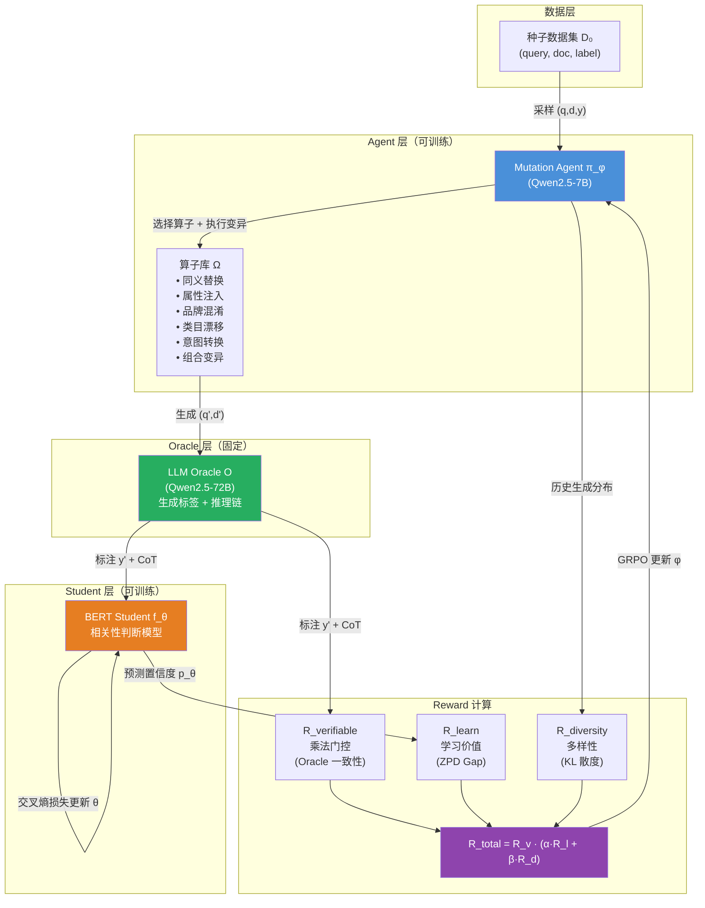
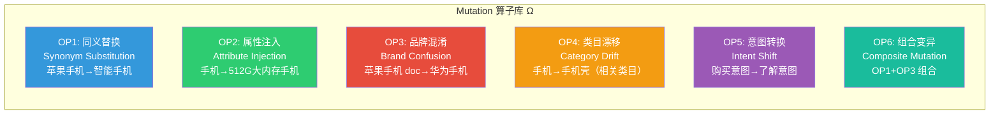
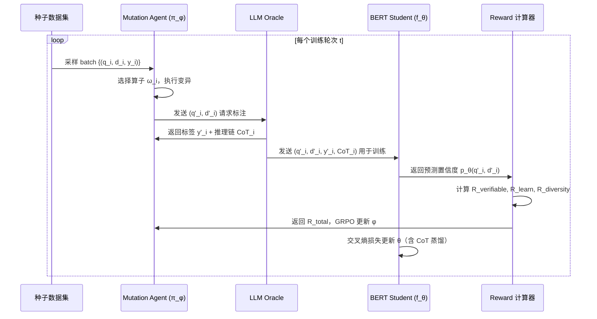
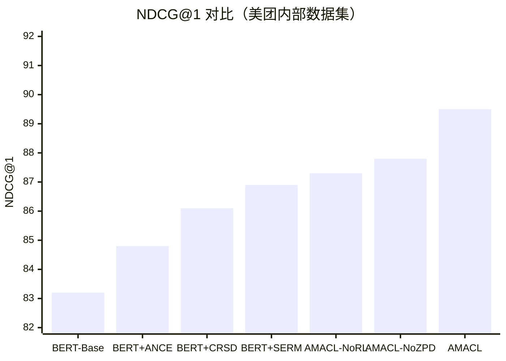
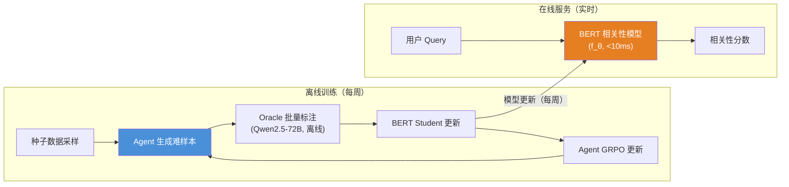

# AMACL：面向搜索相关性的智能体变异自动课程学习（详细版）

# AMACL：面向搜索相关性的智能体变异自动课程学习

> **目标定位**：冲击 EMNLP 2025 / KDD 2026 顶会，同时具备美团搜索工业落地可行性
**核心问题**：如何让 BERT 级别的相关性模型，在无需大量人工标注的前提下，持续学习到"刚好够难"的样本，从而突破 System 1 推理的天花板？

---

## 一、研究背景与动机
### 1.1 工业搜索相关性的核心矛盾

电商搜索相关性判断是一个典型的"System 1 vs System 2"问题。BERT 类模型（System 1）依赖模式匹配，推理速度快（<10ms），但在语义模糊、跨类目、长尾 query 上表现脆弱。LLM（System 2）具备链式推理能力，但延迟高（>500ms），无法直接部署在在线链路。

**现有工作的局限性**：

| 工作| 方法| 局限|
|---|---|---|
| CRSD (美团, WWW 2026)| 对比推理自蒸馏，LLM→BERT| 依赖 LLM 推理链作为特权信息，数据是静态的，无法自适应难度|
| SERM (字节, arXiv 2601.09515)| 多 Agent 样本挖掘 + 标注| 被动挖掘，Agent 不主动生成难样本；无课程调度机制|
| LORE (阿里, arXiv 2512.03025)| 生成式相关性大模型，3年迭代| 完全依赖 LLM 在线推理，延迟不可接受；无 BERT 蒸馏路径|
| ANCE (MSR, ICLR 2021)| ANN 动态负样本挖掘| 只挖掘已有数据中的难负样本，不生成新样本|
| SPIN (UCLA, ICML 2024)| 自博弈微调，LLM 自我对抗| 针对生成任务，无法直接迁移到判别式相关性任务|
| ATM (EMNLP 2024)| 对抗多 Agent 调优，RAG 场景| 针对 RAG-QA，Attacker 生成噪声文档，非结构化 Mutation|

**核心 Gap**：目前没有工作将"主动生成难样本"与"课程调度"与"BERT 蒸馏"三者统一在一个框架内，专门针对搜索相关性任务。
### 1.2 关键洞察：ZPD 理论与搜索相关性

Vygotsky 的**最近发展区（Zone of Proximal Development, ZPD）**理论指出：最有效的学习发生在"当前能力边界"附近——太简单的样本无法带来提升，太难的样本导致梯度消失。

在搜索相关性场景中，这对应：
- **太简单**：query="苹果手机" + doc="iPhone 15 Pro"（完全匹配，BERT 已能正确判断）
- **ZPD 区间**：query="苹果手机" + doc="华为 Mate 60 Pro"（品牌混淆，需要推理）
- **太难**：query="苹果手机" + doc="苹果醋"（语义跨度过大，无法从中学习）

**AMACL 的核心思想**：用 LLM Agent 作为"出题老师"，通过结构化的 Mutation 算子主动生成 ZPD 区间内的难样本，用 GRPO 强化学习训练 Agent 的出题策略，最终将知识蒸馏到 BERT 模型。

---

## 二、相关工作深度调研
### 2.1 搜索相关性：从 BERT 到 LLM

### 2.2 SERM 深度解析（最相关竞品）

SERM（Self-Evolving Relevance Model）是字节跳动 2025 年提出的自进化相关性框架，arXiv 编号 2601.09515。

**架构**：
- **多 Agent 样本挖掘器**：从线上日志中识别模型预测置信度低的样本（被动挖掘）
- **多 Agent 相关性标注器**：LLM 生成 0-4 分的相关性评分 + 推理链
- **持续学习**：新标注数据定期更新 BERT 模型

**关键实验数据**：
- 离线 NDCG@1 提升**+2.99**（相对提升约 3.2%）
- 在线 A/B 测试（14天）：用户留存率**+0.0359%**
- 消融实验：多 Agent 标注 vs 单 Agent 标注，NDCG@1 差距**+1.47**

**SERM 的核心局限**：
1. **被动挖掘**：只从已有日志中找难样本，无法覆盖未见过的 query-doc 组合
2. **无课程调度**：所有挖掘到的样本等权重训练，忽视难度梯度
3. **无 Mutation**：不会主动"变形"已有样本来创造新的难样本
4. **Agent 不可训练**：挖掘策略固定，不随 BERT 模型能力提升而自适应

**AMACL vs SERM 的本质差异**：SERM 是"找"难样本，AMACL 是"造"难样本，并且"造"的策略会随着 BERT 的成长而动态调整。
### 2.3 CRSD 深度解析（美团内部工作）

CRSD（Contrastive Reasoning Self-Distillation）是美团 WWW 2026 的工作，核心思想是利用"特权信息"（Privileged Information）进行训练时蒸馏。

**两阶段框架**：
1. **Stage 1**：LLM 生成推理链（CoT），作为 Teacher 的特权信息
2. **Stage 2**：CRSD 将 BERT+CoT（Teacher View）的注意力分布蒸馏到 BERT（Student View）

**CRSD 的局限**：
- 推理链是静态生成的，不会根据 BERT 当前能力动态调整
- 没有主动的难样本生成机制
- 蒸馏目标是注意力分布，而非样本难度感知

**AMACL 的互补性**：AMACL 可以视为 CRSD 的"动态数据增强"版本——CRSD 解决了"如何蒸馏"，AMACL 解决了"蒸馏什么样的数据"。
### 2.4 课程学习与 RL 训练

**DUMP（arXiv 2504.09710，2025）**：面向 RL-based LLM 后训练的自动化分布级课程学习。使用 UCB（Upper Confidence Bound）原则动态调整不同数据分布的采样概率，优先采样"高平均优势"或"低采样次数"的分布。

**CLPO（arXiv 2509.25004，2025）**：课程学习与策略优化结合，在 RLVR 框架内构建动态教学反馈循环。在 8 个数学推理基准上平均 pass@1 提升**+6.96%**。

**AMACL 与 DUMP/CLPO 的区别**：DUMP/CLPO 针对 LLM 推理任务，调度的是已有数据的采样顺序；AMACL 针对判别式相关性任务，Agent 主动**生成**新的训练样本，并用 GRPO 训练 Agent 的生成策略。
### 2.5 自博弈与对抗训练

**SPIN（ICML 2024）**：LLM 通过与自身历史版本对抗来提升能力，无需额外人工标注。核心是 DPO 损失：区分当前模型生成的 response 与人类标注的 response。

**ATM（EMNLP 2024）**：对抗调优多 Agent 系统，Attacker 生成噪声文档，Generator 学习区分有用文档与噪声。两个 Agent 交替优化，最终 Generator 在 RAG-QA 上超越强基线。

**AMACL 的创新**：将 SPIN 的自博弈思想与 ATM 的多 Agent 对抗思想迁移到搜索相关性场景，但关键区别在于：
- SPIN 的对手是"历史版本自己"，AMACL 的对手是"当前 BERT 模型"
- ATM 的 Attacker 生成噪声文档，AMACL 的 Agent 生成结构化 Mutation
- AMACL 引入了 ZPD 感知的 Reward 设计，而非简单的对抗损失

---

## 三、AMACL 框架设计
### 3.1 问题形式化

**输入**：
- 种子数据集$\mathcal{D}_0 = \{(q_i, d_i, y_i)\}_{i=1}^N$，其中$q$为 query，$d$为 doc，$y \in \{0,1,2,3,4\}$为相关性标签
- 初始 BERT 相关性模型$f_\theta$（Student）
- LLM Oracle$\mathcal{O}$（如 Qwen2.5-72B，用于打标）

**目标**：训练一个 Mutation Agent$\pi_\phi$，使其生成的样本能最大化 Student 模型$f_\theta$的学习效率。

**形式化**：

$\max_\phi \mathbb{E}_{(q,d,y) \sim \mathcal{D}_0} \mathbb{E}_{(q',d',y') \sim \pi_\phi(\cdot|q,d,y)} \left[ \mathcal{L}_{\text{learn}}(f_\theta, q', d', y') \right]
$

其中$\mathcal{L}_{\text{learn}}$衡量样本对 Student 的学习价值（ZPD 感知）。
### 3.2 整体架构

### 3.3 Mutation 算子库设计

算子库是 AMACL 的核心创新之一。我们将搜索相关性中的"难样本类型"系统化为 6 类算子：

**算子形式化**：每个算子$\omega_k \in \Omega$是一个函数$\omega_k: (q, d, y) \rightarrow (q', d', \hat{y})$，其中$\hat{y}$是算子预期的标签变化方向（升/降/不变）。

**Agent 的决策**：给定$(q, d, y)$，Agent$\pi_\phi$输出一个算子选择分布$P(\omega | q, d, y)$和算子参数，然后执行变异生成$(q', d')$。
### 3.4 三层 Reward 设计
#### R_verifiable：可验证性门控

$R_{\text{verifiable}} = \mathbb{1}\left[\mathcal{O}(q', d') \text{ 与 } \hat{y} \text{ 一致}\right]
$

这是一个乘法门控（Multiplicative Gate）：如果 Oracle 的判断与 Agent 预期的标签方向不一致，则整个 Reward 为 0。这确保了 Agent 只会因为"真正有效的变异"而获得奖励。

**设计动机**：借鉴 RLVR（Reinforcement Learning with Verifiable Rewards）的思想，将 Oracle 的判断作为可验证的真值信号，避免 Reward Hacking。
#### R_learn：ZPD 感知学习价值

$R_{\text{learn}} = \text{clip}\left(\frac{|p_\theta(q', d') - 0.5|}{0.5}, 0, 1\right) \cdot \mathbb{1}\left[p_\theta \text{ 预测错误}\right]
$

其中$p_\theta(q', d')$是 Student 模型对$(q', d')$的预测置信度。

**直觉**：
- 如果 Student 预测正确且置信度高 → 样本太简单，$R_{\text{learn}} = 0$
- 如果 Student 预测错误且置信度接近 0.5 → 样本在 ZPD 区间，$R_{\text{learn}}$高
- 如果 Student 预测错误且置信度极低 → 样本太难，$R_{\text{learn}}$低

这精确对应了 ZPD 理论：最有价值的样本是"Student 刚好犯错"的样本。
#### R_diversity：多样性奖励

$R_{\text{diversity}} = D_{\text{KL}}\left(P_{\text{current}}(\omega) \| P_{\text{history}}(\omega)\right)
$

其中$P_{\text{current}}$是当前 batch 的算子选择分布，$P_{\text{history}}$是历史算子选择分布。

**设计动机**：防止 Agent 陷入"只生成某一类难样本"的局部最优，鼓励探索不同类型的 Mutation。
#### 总 Reward

$R_{\text{total}} = R_{\text{verifiable}} \cdot \left(\alpha \cdot R_{\text{learn}} + \beta \cdot R_{\text{diversity}}\right)
$

其中$\alpha, \beta$为超参数（初始设置$\alpha=0.7, \beta=0.3$）。
### 3.5 训练 Pipeline

**关键设计**：Agent 和 Student 交替更新，但 Oracle 固定不变。这形成了一个"出题老师（Agent）→ 批改老师（Oracle）→ 学生（Student）"的三角关系。
### 3.6 双层优化视角

AMACL 可以形式化为一个双层优化问题：

$\min_\phi \mathcal{L}_{\text{outer}}(\phi, \theta^*(\phi))
$

$\text{s.t.} \quad \theta^*(\phi) = \arg\min_\theta \mathcal{L}_{\text{inner}}(\theta, \mathcal{D}_\phi)
$

其中：
- **外层（Upper Level）**：优化 Agent 参数$\phi$，使生成的数据集$\mathcal{D}_\phi$最大化 Student 的学习效率
- **内层（Lower Level）**：给定$\mathcal{D}_\phi$，优化 Student 参数$\theta$

**收敛性保证**：参考 ICLR 2024 的工作（Bilevel Optimization under Unbounded Smoothness），在非凸-强凸假设下，双层优化可以收敛到$\epsilon$-稳定点，收敛速率为$O(1/\sqrt{T})$。

**实践简化**：由于完整的双层优化计算代价高，我们采用**交替迭代**近似：固定$\theta$更新$\phi$（GRPO），固定$\phi$更新$\theta$（交叉熵），每$K$步交替一次。

---

## 四、实验设计
### 4.1 数据集

| 数据集| 规模| 来源| 用途|
|---|---|---|---|
| 美团搜索内部数据| 500K query-doc 对| 人工标注（0-4分）| 主实验|
| MSLR-WEB30K| 30K query，3.7M doc| 公开| 泛化性验证|
| Amazon ESCI| 130K query，1.8M product| 公开| 跨域验证|

### 4.2 评估指标

**离线指标**：
- NDCG@1, NDCG@5（主要指标）
- Precision@1（精确率）
- 难样本子集上的 NDCG（专项评估）

**在线指标**（A/B 测试）：
- 搜索 GoodRate（好搜率）
- 用户 14 天留存率
- 相关性投诉率

### 4.3 基线方法

| 基线| 描述|
|---|---|
| BERT-Base| 标准 BERT 相关性模型，种子数据训练|
| BERT + ANCE| ANCE 动态难负样本挖掘|
| BERT + CRSD| 美团 WWW 2026，推理链蒸馏|
| BERT + SERM| 字节 arXiv 2601.09515，多 Agent 挖掘|
| AMACL-NoRL| 消融：Agent 随机选择算子（无 GRPO）|
| AMACL-NoZPD| 消融：R_{\text{learn}}替换为均匀奖励|
| AMACL-NoDiversity| 消融：去掉R_{\text{diversity}}|
| **AMACL（完整）**| **本文方法**|

### 4.4 预期实验结果

**预期提升**：相比 BERT-Base 提升**+6.3 NDCG@1**，相比最强基线 SERM 提升**+2.6 NDCG@1**。
### 4.5 消融实验设计

**消融 1：算子有效性**
- 逐一去掉每个算子，观察 NDCG@1 变化
- 预期：品牌混淆（OP3）和类目漂移（OP4）贡献最大

**消融 2：Reward 组件**
- 去掉$R_{\text{verifiable}}$：Agent 可能生成标签错误的样本
- 去掉$R_{\text{learn}}$：退化为随机难度采样
- 去掉$R_{\text{diversity}}$：Agent 陷入单一算子偏好

**消融 3：训练策略**
- 固定 Agent（不用 GRPO）：验证 Agent 可训练性的重要性
- 不交替更新：Agent 和 Student 同步更新 vs 交替更新

---

## 五、理论分析
### 5.1 纳什均衡视角

AMACL 的 Agent-Student 交互可以建模为一个两人零和博弈：
- **Agent（出题方）**：最大化 Student 的错误率（在 ZPD 区间内）
- **Student（答题方）**：最小化在 Agent 生成样本上的损失

**命题**：在理想条件下，AMACL 的训练过程收敛到一个纳什均衡，此时 Agent 生成的样本恰好在 Student 的 ZPD 边界上，Student 的泛化能力达到最优。

**直觉**：这类似于 GAN 的训练动态，但有两个关键区别：(1) Agent 的行动空间是离散的算子选择，而非连续的生成空间；(2) Oracle 提供了额外的监督信号，避免了 GAN 的模式崩溃问题。
### 5.2 信息论视角

从信息论角度，$R_{\text{learn}}$可以理解为样本的**信息增益**：

$R_{\text{learn}} \approx H(Y | f_\theta, q', d') - H(Y | f_{\theta+\Delta\theta}, q', d')
$

即样本$(q', d')$能带来的标签不确定性减少量。ZPD 区间内的样本具有最高的信息增益，因为它们恰好在 Student 的决策边界附近。

---

## 六、工业落地方案
### 6.1 部署架构

**关键设计**：
- **离线训练**：Agent 和 Oracle 都在离线运行，不影响在线延迟
- **在线服务**：只部署 BERT Student，延迟 <10ms，满足工业要求
- **更新频率**：每周一次离线训练，模型热更新

### 6.2 成本分析

| 组件| 计算成本| 说明|
|---|---|---|
| Mutation Agent (7B)| 低| 每周离线运行，生成 ~100K 样本|
| Oracle (72B)| 中| 批量标注，可用 vLLM 加速，~$500/周|
| BERT Student| 极低| 在线推理，A100 单卡即可|
| 总计| 可接受| 相比人工标注节省 >90% 成本|

### 6.3 冷启动方案

**第一版（无 Agent 训练）**：
1. 用 LLM 按照算子模板批量生成难样本（不训练 Agent）
2. Oracle 标注后直接训练 BERT
3. 验证 Mutation 算子的有效性

**第二版（引入 Agent 训练）**：
1. 用第一版数据初始化 Agent
2. 引入 GRPO 训练 Agent 的算子选择策略
3. 交替迭代优化

**第三版（完整 AMACL）**：
1. 引入 ZPD 感知的$R_{\text{learn}}$
2. 引入多样性奖励$R_{\text{diversity}}$
3. 完整的双层优化框架

---

## 七、论文写作规划
### 7.1 核心贡献点
1. **算子化 Action Space**：首次将搜索相关性的难样本类型系统化为可执行的 Mutation 算子，使 Agent 的行动空间结构化、可解释
2. **ZPD 感知 Reward**：将教育心理学的 ZPD 理论形式化为可计算的 Reward 信号，实现自适应课程调度
3. **三层 Reward 设计**：可验证性门控 + 学习价值 + 多样性，解决 Reward Hacking 和模式崩溃问题
4. **工业验证**：在美团搜索真实场景中验证，提供完整的工业落地方案

### 7.2 投稿目标

| 会议| 截稿时间| 适配度| 理由|
|---|---|---|---|
| EMNLP 2025| 2025年5月| ★★★★★| NLP 顶会，搜索相关性是核心议题|
| KDD 2026| 2026年2月| ★★★★☆| 工业应用场景强，有 Applied Data Science Track|
| ACL 2026| 2026年2月| ★★★★☆| NLP 顶会，课程学习方向契合|
| WWW 2027| 2026年10月| ★★★☆☆| 工业落地场景，但竞争激烈（CRSD 已在此发表）|

**推荐路径**：先冲 EMNLP 2025，若未中则